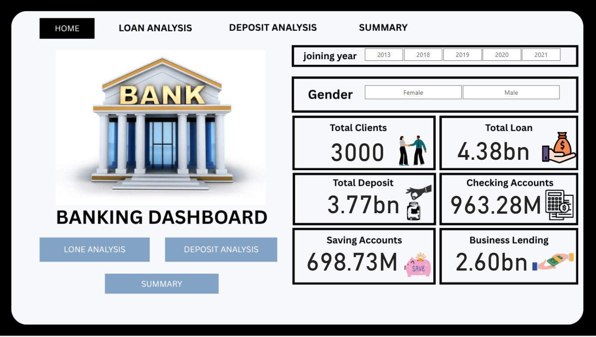
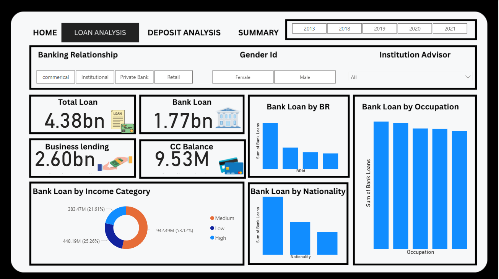
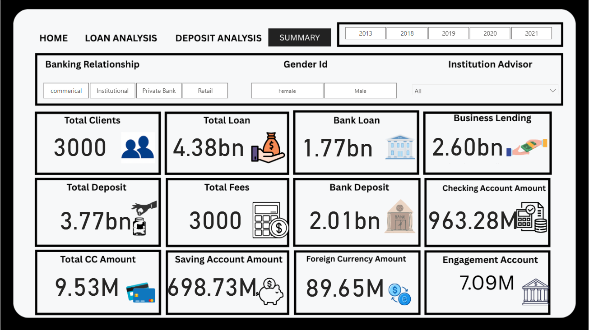

🏦 Banking Risk Analysis Dashboard
📌 Project Overview

The Banking Risk Analysis Dashboard is a data analytics project designed to analyze and visualize key banking metrics related to loans, deposits, customer behavior, and overall financial performance.
The dashboard provides interactive insights that help understand banking risks, customer distribution, and financial trends over time.

This project focuses on data-driven decision-making using clear KPIs and visual storytelling.

🎯 Objectives

Analyze loan and deposit patterns

Understand customer demographics (gender, occupation, nationality)

Track bank performance metrics

Identify risk exposure and financial distribution

Provide a summarized view for quick decision-making

📊 Dashboard Pages
🏠 Home

Overview of key banking KPIs

Total clients, loans, deposits, savings, and business lending

High-level snapshot of bank performance

💳 Loan Analysis

Total loan amount and bank loan distribution

Business lending analysis

Loan breakdown by:

Banking relationship

Income category

Occupation

Nationality

Credit card balance insights

💰 Deposit Analysis

Total deposits and bank deposits

Savings and checking account amounts

Deposit distribution by:

Banking relationship

Income category

Occupation

Nationality

📈 Summary

Consolidated view of all major KPIs

Client count, loans, deposits, fees, foreign currency, and engagement accounts

Quick insights for management-level decisions

🔍 Key Features

Interactive filters (Year, Gender, Banking Relationship)

KPI cards for quick insights

Bar charts and donut charts for clear comparison

Clean and user-friendly dashboard layout

🛠️ Tools & Technologies

Power BI – Dashboard creation & visualization

Data Analysis – Aggregation and KPI calculations

Excel / CSV – Data source (if applicable)

📷 Dashboard Screenshots

Add screenshots below for better visualization:

🚀 Conclusion

This project demonstrates strong skills in data analysis, dashboard design, KPI identification, and business analytics.
It is suitable for banking analytics, financial risk analysis, and data analyst portfolio projects.
